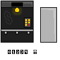

# The Hiss(kibidi)

Oscar Tafvelin 2024-12-13

## Inledning

Syftet med uppgiften var att i grupp eller ensam programmera och eventuellt konstruera en fungerande hiss. Min grupp valde att programmera i C# och använda spelmotorn Unity för att möjliggöra en 2d-rendering av hissen. Sprites gjordes även mot slutet.

## Bakgrund

Vi fick instruktioner att först programmera hissen endast i C# och sedan flytta över detta till Unity. Vi använde vscode och bytte ut vem som aktivt programmerade ofta så att alla fick programmera och ingen satt och gjorde ingenting. 

Själva hissen fungerar genom två köer, en upp-kö och en ner-kö. Varje plats i köerna korresponderar till en våning som hissen kan åka till. När man trycker på en knapp utanför hissen (upp-/ner-pil) så sparas den våning hissen ska till i den korresponderande kön, (trycker man på upp-knappen på våning 3 ändras plats 3 i upp-kön till true och hissen stannar vid den våningen bara när den är på väg uppåt). Trycker man på en knapp inuti hissen ändras våningens plats i båda köerna till true eftersom hissen ska stanna vid den våningen oavsett om den färdas uppåt eller nedåt.

Efter att vi var klar med koden och det fungerade (trodde vi) så flyttade vi till Unity och märkte att det inte riktigt fungerade som det skulle. Efter några lektioners troubleshooting och några band-aid-fixes samtidigt som vi jobbade på alla 2d element i Unity-editorn så hade vi äntligen en hiss som fungerade och då återstod bara lite visuella uppdateringar samt roliga additions, såsom nya sprites, (kolla bild nedan), en fail-chans (så att hissen slutar fungera ibland (för att det är roligt)) och en alarm-knapp (som exploderar hiss om den används i onödan (för att det är roligt) och fixar den om den slutat fungera).

## Positiva erfarenheter

Jag tycker själva grupparbetet har gått ganska bra. Även om vissa personer visste mer om vissa områden, (Kevin(Unity)), så var alla aktiva och engagerade i projektet och vi diskuterade lösningar tillsammans, samt lät alla programmera. Jag har lärt mig mer om Unity och C# och detta projekt har varit givande för min utveckling som programmerare, både inom problemformulering och problemlösning.

## Negativa erfarenheter

Mycket tid slösades i början på grund av alla instruktioner vi fick av Jens. Våran originella idé var att vi skulle börja med Unity, men Jens sa att vi inte skulle göra det och istället skulle använda ai för att ai-generera python kod utifrån våran pseudokod, som vi sedan skulle använda som mall till våran riktiga C# kod (?????). Vi försökte med detta, men vi fick ingenting gjort för att det var för constricting. Så vi hoppade direkt till att göra C# kod som vi sedan portade till Unity.

## Sammanfattning

Sammanfattningsvis så var det mycket svårare än förväntat att programmera en hiss. Jag trodde från början att det skulle vara en relativt simpel uppgift men hissar visade sig vara mycket mer komplicerade än jag förväntat. Jag är stolt över slutprodukten men det hade fortfarande kunnat göras förbättringar på programmet. Det finns några band-aid fixes och funktioner som kanske inte fungerar 100% som de ska, men slutprodukten är en funktionsduglig hiss med några småfel.